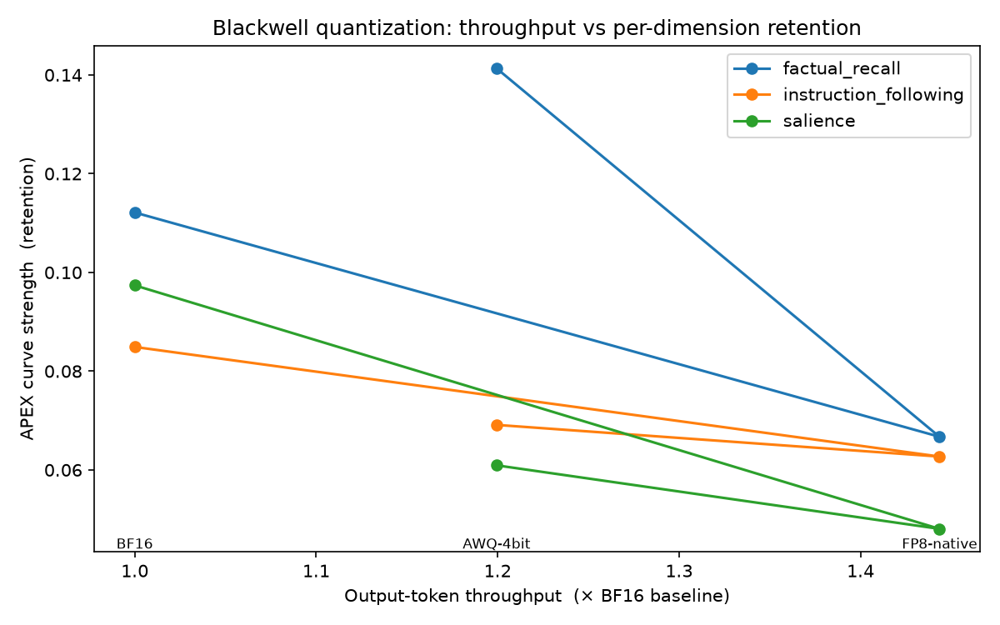

# blackwell-quant-tradeoff

**Per-capability quantization degradation on NVIDIA Blackwell (RTX 5090, sm_120).**

As quantization drops BF16 → FP8-native → AWQ-4bit, throughput rises. This study
measures whether model quality degrades *uniformly* across capabilities or
*differentially* — using [APEX](https://github.com/vshortt73/apex)'s three
independent dimensions (factual recall, instruction following, salience) as the
quality instrument, anchored by task accuracy and perplexity.

The finding a serving team actually needs is not "quality dropped X%." It's
*which* capability drops, and at *what* precision. That per-capability profile is
what nothing in the vLLM-benchmark literature currently reports.

> **Status:** methodology and harness complete; harness verified end-to-end
> against a live vLLM 0.27.1 server on the 5090 (AWQ arm). Study results pending
> runs. No numbers in this repo are fabricated — `results/raw/` fills only when
> you run the harness. Headline figure regenerates from raw via
> `results/analysis.py`.
>
> **Model under test:** Qwen3-8B (dense 8B), three official checkpoints —
> BF16 / FP8 (e4m3) / AWQ-4bit. Sized so all three arms fit one 32 GiB card with
> KV headroom; see `configs/`.

## Headline

_(populated after runs — throughput gain vs per-dimension retention; where the
three dimension curves separate is the result.)_

<!-- Generated by results/analysis.py once results/raw/ holds serving + apex
     results for all three schemes. Uncomment when the PNG exists.

-->

## Why this design is defensible

- **Pre-registered** methodology (`METHODOLOGY.md`) — written before the runs.
- **Locked clocks + fixed power** (`env/gpu_setup.sh`) so no number is thermally
  throttled mid-sweep.
- **Same base weights** across schemes; **only** the quant scheme varies.
- **Greedy decoding** for all quality — deltas attributable to the scheme, not
  RNG.
- **N≥5 repeats, mean ± CI**; **environment fingerprint** stamped into every
  result JSON; dirty git tree warns loudly.
- **Percentile latency** (p50/p90/p99), throughput split into request vs
  **output-token**, single vs concurrent regimes never conflated.

## Repro (five commands)

```bash
# 1. environment -- requirements.lock is a full pip freeze of the VALIDATED
#    sm_120 stack (torch 2.13.0+cu130 / vLLM 0.27.1). Use a venv: vLLM pins an
#    exact torch and will otherwise replace whatever you already have.
python3 -m venv .venv && .venv/bin/pip install -r env/requirements.lock

# 2. lock the GPU into a fixed state
sudo ./env/gpu_setup.sh 0 2400 500        # <gpu> <sm_clock_mhz> <power_w>

# 3. start vLLM for a scheme. Quantization is auto-detected from the
#    checkpoint; the attention backend is NOT, so pin it (controlled variable).
#    Exact per-scheme command is in the launch comment of each configs/*.yaml.
VLLM_ATTENTION_BACKEND=FLASH_ATTN VLLM_USE_DEEP_GEMM=0 \
  .venv/bin/vllm serve /path/to/Qwen3-8B-FP8 \
    --gpu-memory-utilization 0.85 --max-model-len 8192 \
    --port 8000 --served-model-name model-under-test

# 4. run the harness against that scheme (repeat per scheme)
.venv/bin/python harness/run_serving_bench.py configs/fp8_native.yaml
.venv/bin/python harness/run_quality_eval.py  configs/fp8_native.yaml
.venv/bin/python harness/run_apex_eval.py     configs/fp8_native.yaml  # after wiring APEX

# 5. build the headline figure + tables
.venv/bin/python results/analysis.py
```

## Layout

```
env/          pinned Dockerfile, requirements.lock, gpu_setup.sh (clock lock)
configs/      one YAML per scheme; controlled vars identical across all
harness/      serving bench, quality anchors, APEX adapter, grader, fingerprinting
results/raw/  immutable per-run JSON (committed); analysis.py builds plots/tables
writeup/      the differentiated study skeleton
METHODOLOGY.md  pre-registration
LANDMINES.md    sm_120 serving field log
```

## What you must wire before running

1. **APEX adapter** — `harness/run_apex_eval.py::run_apex()` raises
   `NotImplementedError` by design so it cannot emit fabricated quality data.
   Point it at your installed APEX (import or subprocess) against the vLLM
   OpenAI endpoint; return one `ApexDimensionResult` per dimension.
2. **Data** — `tasks.jsonl` is the last piece you must supply. One JSON object
   per line; see `data/tasks.example.jsonl`:

   ```jsonl
   {"prompt": "The capital of France is", "answer": "Paris"}
   {"prompt": "The largest US city is", "answer": "New York City", "aliases": ["NYC"]}
   ```

   Optional per item: `"aliases": [...]`, `"whole_response": true`.

   Three constraints shape the content:
   - **Stems, not questions.** These hit `/v1/completions` with no chat
     template, so `"What is the capital of France?"` invites the model to
     continue with *more questions*. `"The capital of France is"` does not.
   - **The answer must land in the first sentence, within 32 tokens**
     (`quality.max_tokens`), because the grader scopes to the first segment.
   - **Calibrate difficulty.** A set the baseline aces cannot detect
     degradation — every arm scores 1.0. Aim for a baseline of **0.70–0.85**,
     where the model sits at the edge of its competence and small numerical
     perturbations actually flip answers. Avoid public benchmark items
     (GSM8K/MMLU/TriviaQA); they are in the training data.

   Validate before spending GPU time:

   ```bash
   python harness/check_tasks.py data/tasks.jsonl
   python harness/check_tasks.py data/tasks.jsonl --probe --config configs/bf16_baseline.yaml
   ```

   `--probe` reports the difficulty calibration and warns on ceiling/floor.

   > **Privacy:** committed results carry only a hash, verdict and deciding
   > rule per item — never task text. Full prompts and responses go to
   > `results/audit/`, which is gitignored. So a task set built from private
   > material stays private while the rule mix remains publicly auditable.

   The other two inputs are generated:
   - `prompt_file` — `harness/make_prompts.py` (deterministic, committed).
   - `corpus_file` — `harness/build_corpus.py`, which turns private
     unpublished prose into one-passage-per-line text. It strips markdown
     structure (format predictability is not language modelling), excludes
     model-written and third-party documents by filename, drops passages
     matching credential/PII patterns, deduplicates, and reports statistics
     only — never file contents. Output stays gitignored.

     ```bash
     python harness/build_corpus.py --root /path/to/private/docs \
         --out data/heldout_corpus.txt
     ```

     "Held-out" is the whole ballgame: public text is in the model's training
     data, and memorised text does not merely read low, it may degrade
     differently under quantization and so corrupt the delta itself. As a
     sanity check, genuinely unseen prose scored **38.6** perplexity here
     against **11.5** for formulaic text — the model is predicting, not
     recalling.

Done (kept here as a record of what was verified rather than assumed):

3. ~~**Version pins**~~ — `env/requirements.lock` now holds 203 exact pins
   captured by `pip freeze` from the validated venv.
4. ~~**Perplexity token selection**~~ — fixed. `prompt_logprobs` returns the
   top-1 token *and* the realized token when they differ, so the original
   `max(logprob)` scored the model's greedy path rather than the corpus
   (perplexity 1.66 vs a true 5.37). Now resolved by id via
   `return_token_ids`. See `LANDMINES.md`.
5. ~~**Task grading**~~ — exact match scored 0.0 for every scheme (the model
   answers correctly, then elaborates), making the anchor blind to degradation.
   Replaced by `harness/grader.py`: deterministic goal-satisfaction grading —
   first-segment scoping, word-boundary matching, numeric tolerance, aliases,
   negation guard. Deterministic by design so grader variance cannot
   contaminate the BF16→FP8→AWQ delta. Tests: `harness/test_grader.py`.

## Sequence (per the plan)

1. Baseline the harness on the **4080 Super (sm_89)** — fully supported, removes
   "is it my config or the hardware?" ambiguity.
2. Port to the **5090**, log every sm_120 landmine in `LANDMINES.md`.
3. Run the three-scheme tradeoff study; write it up.
4. *(optional)* TensorRT-LLM cross-check as a second, smaller artifact.
